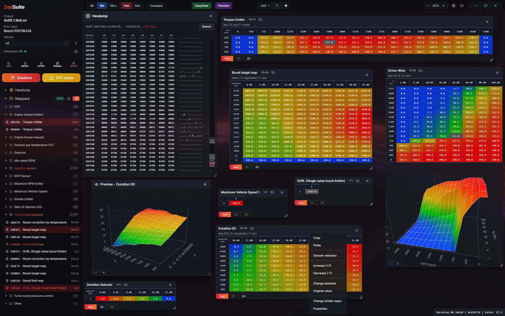

# ZedSuite

**English** · [Français](README.fr.md)

   

**Open source map editor for VAG-group Bosch EDC15/EDC16 ECUs — 100% local.**

Drop in an ECU dump and ZedSuite finds the maps for you — Driver Wish, Turbo Boost, N75, SOI, torque limiters and the rest. Edit them in a table, on a 2D graph or a 3D surface, or straight in the hexdump. Keep versions, compare them, disable DTCs, fix the checksum, export your binary or a WinOLS mappack.

No account, no cloud, no limits: everything runs locally and your files stay on your computer.



## 🚗 Supported ECUs

| ECU | Detection |
|-----|-----------|
| Bosch EDC15P | pattern + codeblock based |
| Bosch EDC15VM+ | pattern + codeblock based |
| Bosch EDC16U1 | signature based |
| Bosch EDC16U31 | signature based |
| Bosch EDC16U34 | signature based |

Identification is strict by design: a file is only opened as one of these ECUs when it carries positive evidence (Bosch hardware numbers, family strings, structural signatures). A 2 MB dump from another ECU (EDC17, Marelli, Siemens, …) is rejected instead of being misread as an EDC16.

Detection is not perfect either. Each family was calibrated on a bench made of every file I had available, but I did not have as many different EDC16U31 dumps as for the other families: on some U31 files, part of the maps may not be detected. Same thing on EDC15VM: some maps may not show up, especially on the 1 MB dumps of the V6 engines, which I deliberately left unfinished because it would have taken too much more time. In any case, when the maps are fully detected on EDC15/16, the mappacks are of unbeatable quality compared to what is available on the market.

## ⚙️ Features

- **Automatic map detection** — embedded Rust engine, per-family detectors
- **Detection completeness check** — a confidence badge shows whether every map expected for the ECU family was found, with the missing ones detailed in one click
- **Map editor** — table, 2D graph and 3D surface views, WinOLS-style shortcuts
- **Hexdump editor** — virtualized, minimap, modification highlighting vs original
- **Versioning** — "Ori" + named versions per project, compare view
- **Lean storage** — original binary + a modification file per version, rebuilt automatically at export
- **Virtual dyno** — power/torque estimation from the maps, printable PDF report
- **DTC Off** — detect and disable diagnostic trouble codes
- **Solutions** — one-click patches (launch control, …); deliberately kept to a minimum so the release wouldn't take even more time, more may come later
- **Checksum correction** — EDC15 family and EDC16, implemented natively
- **Brand auto-fill** — embedded ECU reference database (Bosch/VAG part numbers)
- **Exports** — modified `.bin`, JSON mappack compatible with WinOLS 5
- **Automatic updates** — the app checks GitHub once a day for new releases; one click to install
- **3 themes** — dark, light and OLED, for every kind of screen
- **Any screen size** — resizable map panel and browser-style zoom in the editor, from laptops to ultrawides
- **Two languages** — English and French; adding another is easy (a single translations file), and map names are deliberately untranslated — they stay in English

## 🔧 Working with modified files

The detection engine is deliberately built on **structure, not data**: it anchors on headers, axis layouts and signatures that survive a remap, so stage 1/2/3 files are detected fine in the vast majority of cases, a lot of bench work went specifically into that.

That said, an **extremely modified file** (rewritten axes, relocated blocks, aggressive protection patches) can still hide some maps from the scanner. The recommended workflow is:

1. Create the project from the **original (stock) file**: that's where detection finds every map.
2. Import the modified file as a **new version** of that project.

All versions of a project share the map list detected on the original, so you get the complete map set on the tuned file too, plus the compare view between versions for free.

## 🏗️ How it was built

ZedSuite started life as a web SaaS: a Next.js editor talking to a Rust (Actix) detection microservice. That version was meant to go much further: the plan was to launch with the whole VAG diesel range supported, up to the MD1, plus the older EDC15/16/17 diesels of the other brands. But I no longer had the time to finish that project, as I had to focus on other things, so I chose to release what was truly solid instead: the VAG EDC15/EDC16 scope, finished properly, as a fully local open source desktop tool.

On the design side, I tried to blend the most interesting features of the two tools I spent years with: the automatic detection and simplicity of EDCSuite, and the editing comfort of WinOLS.

Technically, the Rust engine moved into the Tauri shell as plain IPC commands, and the frontend still speaks to the old `/api/*` surface, which `src/lib/local/api.ts` reimplements on top of the on-disk store. This kept the editor code identical to the battle-tested web version while removing every server dependency.

The detection engine itself is the result of long reverse-engineering sessions on real dumps: each ECU family has its own detector, built by locating maps in WinOLS/damos-style references, extracting the structural signatures that identify them (dimension headers, axis layouts, selector blocks, inter-map spacing), then validating against a bench of real original AND tuned files until the results match the reference lists map for map. Detectors anchor on structure rather than data values precisely so that tuned files keep detecting. The same approach applies to the checksums (EDC15/EDC16 algorithms reimplemented natively, byte-validated against before/after pairs).

Rust for the detection engine was a deliberate choice. The project started as a SaaS meant to be hosted: beyond being much faster than EDCSuite's C# (no .NET runtime, no garbage collector, native machine code in a small standalone binary), I tried to optimize everything as far as possible for a web version where every detection ran server-side. As a result, a full detection takes under a second on any file: about 0.1 s on an EDC15VM (512 KB), 0.3 to 0.5 s on an EDC16 (1 to 2 MB) and around one second on an EDC15P, the heaviest scan. Against C/C++: the same speed, but a much stricter compiler that catches at build time the kind of errors that crash a tool on an unexpected file. And since Tauri is Rust too, the exact same engine that used to run on a server now runs embedded in the app, unchanged.

## 🤝 Contributing

Community contributions are welcome: **new ECU detectors** are the most valuable ones. See [CONTRIBUTING.md](CONTRIBUTING.md) for a walkthrough of the detector architecture. Found a bug or an undetected map? Open an issue with the ECU type and, if possible, the file's software number.

## 🙏 Thanks

- **Dilemma**, who released [VAGEDCSuite](https://github.com/Blackfrosch/VAGEDCSuite) about 14 years ago. That software is how I practiced and learned this craft: automatic map recognition and a dead-simple interface, at a time when nothing else offered that. It is an enormous piece of work for a tool born in the 2000s! (The man must be an alien) A large part of ZedSuite's EDC15 detection logic is directly inherited from the work done in EDCSuite.
- **Skalda**, who [kept VAGEDCSuite alive](https://github.com/skaldamramra/VAGEDCSuite) by updating the map detection and adding a lot of EDC15 maps. My own private build of EDCSuite started from his version, and it is what I used daily until I finally had the time to build ZedSuite.

## 📫 Contact

- 🌐 Website — [zedperf.com](https://zedperf.com)
- 📸 Instagram — [@zedperf](https://instagram.com/zedperf)
- ▶️ YouTube — [@ZedPerf](https://www.youtube.com/@ZedPerf)
- 👥 Facebook — [zedperf](https://www.facebook.com/zedperf.1/)
- 🔗 Everything in one place: [linktr.ee/zedperf](https://linktr.ee/zedperf)

## Buy me a coffee ☕

ZedSuite is free and always will be. If it saved you time or a WinOLS licence, you can fuel the next reverse-engineering sessions:

- **PayPal**: [paypal.me/zedperf](https://www.paypal.com/paypalme/zedperf)
- **BTC** (Bitcoin): `bc1qj2e42vpphx73xguspqd9c6uqrs9ra0yywcq97a`
- **SOL / USDC** (Solana): `AqjSzxi7pBkwcCVkyVxBVLTk9TgPmui71bNgVgNLWrJC`
- **TRX** (Tron): `TRDgrasP7yaEKcz54r8spbmgZdRBFpNerW`

## ⬇️ Download

Grab the installer from the [latest release](https://github.com/LeZed97/ZedSuite/releases/latest): in the **Assets** section, download the `ZedSuite_x.y.z_x64-setup.exe` file and run it. The app then keeps itself up to date on its own.

ZedSuite requires **Windows 10 or 11**. It is not compatible with older versions of Windows: adapting it to Windows 7 would have required a lot more work as well as two separate installers.

## 🚀 Getting started (development)

Prerequisites:
- [Node.js](https://nodejs.org) ≥ 18
- [Rust](https://rustup.rs) (stable) — the detection engine and the app shell are Rust/Tauri
- Windows 10/11 (WebView2 is preinstalled on Windows 11)

```bash
npm install
npm run app:dev     # launches the desktop app with hot reload
```

Build the installer:

```bash
npm run app:build   # produces the NSIS installer under src-tauri/target/release/bundle/
```

## 🧱 Architecture

```
src/                  Next.js frontend (static export, served by the Tauri webview)
  app/dashboard/      project list (opens on startup)
  app/editor/         the map editor
  lib/local/          local backend: on-disk project store + API bridge
  lib/ecu/            TypeScript ECU helpers (DTC lists, checksums)
src-tauri/            Rust desktop shell
  src/detector/       the detection engine (one folder per manufacturer)
  src/commands.rs     IPC commands exposed to the frontend
```

Projects are stored in `%APPDATA%/com.zedsuite.app/projects/` — one folder per project with the original binary, metadata and versions.

## ⚖️ License and trademarks

[GPL-3.0](LICENSE) — you are free to use, study, modify and redistribute ZedSuite, but derivative works must be released under the same license. If you improve the detection engine or add ECU support, the community gets it back.

**The license covers the code only.** The ZedSuite name, logo and mascot are trademarks of ZedPerf and are explicitly excluded from the GPL grant (GPL-3.0 §7(e)): forks are welcome, but they must ship under their own name and branding. Full policy: [TRADEMARKS.md](TRADEMARKS.md). Official builds are published exclusively on [this repository's releases page](https://github.com/LeZed97/ZedSuite/releases).

## ⚠️ Disclaimer

ZedSuite is intended for research, education and motorsport/off-road use. Modifying the ECU of a road vehicle may be illegal in your jurisdiction and can void your warranty, damage your engine, or make your vehicle non-compliant with emissions regulations. You are solely responsible for how you use this software.

**A word on security**: tuning software is a prime target for hackers, who sometimes use free tools to distribute malware. Always download the installer from the [official GitHub](https://github.com/LeZed97/ZedSuite/releases) — it is the only way to be sure you are safe.
